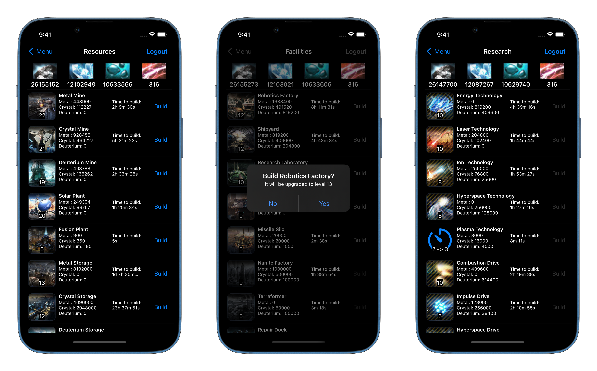
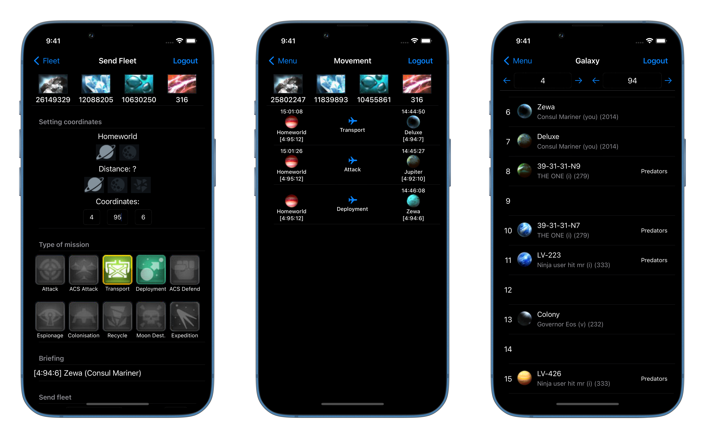

# Abandoned due to release of the official app :(

# OGame for iOS

OGame is a browser-based, money-management and space-war themed massively multiplayer online browser game with over two million accounts.

## Description

This is my pet-project which I'm doing at my free time. I'm still learning iOS development, so this project may have a lot of issues and bugs. Hope for your understanding.
- Project is written with **UIKit**.
- The architecture is **MVP**.
- Interface layout with **code** and some **xibs**.
- Networking with **Alamofire**.
- Parsing **HTML** with **SwiftSoup** framework.

## Screenshots
### Authorization and menu

### Construct buildings, research technologies

### Sending fleet, movement and galaxy

## To-Do
- Show remaining build time online
- Finished buildings notifications
- Incoming attack info in menu
- Check for maximum builds
- Discarding unnecessary network requests
- Messaging, buddy requests, quick espionage
- Update UI with game assets

## Known Issues
- Building times are using local language
- Planets are not added to menu after colonization
- Serial loading of factory levels for time calculations
- Scuffed defense images, queue images
- Send fleet view has no full cargo/distance info
- Admin planets considered yours on galaxy view

## Contributing
Pull requests are welcome. For major changes, please open an issue first to discuss what you would like to change.

Initially based on [@alaingilbert](https://github.com/alaingilbert/) [pyogame](https://github.com/alaingilbert/pyogame/) repository.
